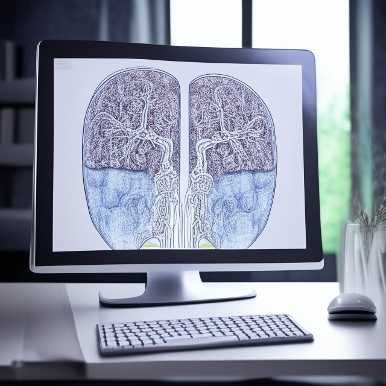

# Proyecto_IA2

Proyecto:
Nuestro trabajo consiste en la localización de nódulos pulmonares por medio de la arquitectura transformer 
presentada en el paper "Attention is all you need". El propósito es mostrar y ajustar (en medida del tiempo del curso) 
el modelo desde sus mecanismos claves como los de atención y positional encoding.

DataSet: 
El conjunto de datos contiene imágenes de tomografías computarizadas (TC) de tórax en formato jpg o png,
e incluye 3 tipos de cáncer de pulmón (adenocarcinoma, carcinoma de células grandes y carcinoma de células escamosas),
así como una carpeta para las células normales.
El conjunto de datos se divide en tres conjuntos: entrenamiento (70%), prueba (20%) y validación (10%).
[Dataset_Link](https://www.kaggle.com/datasets/mohamedhanyyy/chest-ctscan-images/)
[DataSet_link_zip](https://www.kaggle.com/datasets/mohamedhanyyy/chest-ctscan-images/download?datasetVersionNumber=1)
